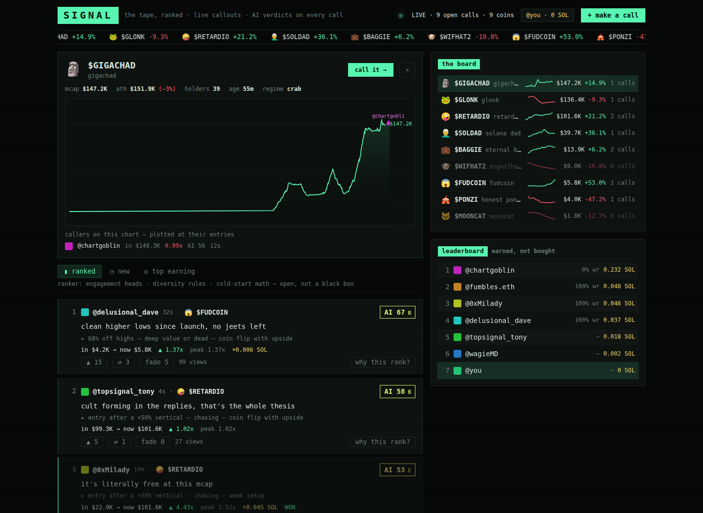

# SIGNAL

**The tape, ranked.** A social layer for the trenches: live memecoin callouts
streamed onto one feed, ranked by an open For-You-style algorithm, with an AI
verdict grading every call 0–100 the moment it's made.



Make a call. Climb the board. Get paid.

- **Live callouts** — every call stamps the caller's entry at the token's
  current mcap, in realtime.
- **Callers on the chart** — every caller is plotted directly on the mcap
  chart at their entry. No revisionism; the tape remembers.
- **AI verdicts** — a transparent factor model (entry vs ATH, chase risk,
  trend, structure/rug risk, caller record, thesis effort) grades every call
  0–100 with a one-line read. Factors are shown on the card — no black box.
- **Open ranker** — the feed order comes from a documented fork of the
  For-You-feed skeleton: engagement heads (agrees/echoes/fades per
  impression), Bayesian cold-start priors + an explore boost for fresh calls,
  geometric author-diversity decay, and exponential time decay — plus two
  trading-native terms: verdict conviction and live performance vs entry.
  Every card has a "why this rank?" breakdown.
- **A leaderboard that's earned, not bought** — winning calls accrue SOL from
  a per-tick reward pool, split by performance × conviction. Win rate and
  earnings are the only status.

## Run it

```bash
npm install
npm run dev     # http://localhost:5173
```

The app boots into a live world immediately: charts have history, bots are
mid-argument, and the tape ticks once per second.

## Architecture

```
src/engine/
  market.ts    market data source — regime-switching mcap walks (accumulation,
               pump, dump, crab, rug). THE SEAM: replace with a real firehose
               (pump.fun websocket / indexer) and everything downstream works.
  rank.ts      the feed ranker (engagement heads, cold start, diversity, decay)
  verdict.ts   the AI verdict factor model — swap in an LLM here; the factor
               readings are its features
  sim.ts       bot callers, organic engagement flow, call resolution, payouts
  store.ts     one mutable world + 1s tick loop, exposed via useSyncExternalStore
src/components/
  CallCard     verdict chip, entry→now multiple, engagement, rank breakdown
  TokenChart   canvas mcap chart with caller entry markers
  Sidebar      token board (sparklines), leaderboard, your calls
  MakeCall     compose flow with live verdict preview before you post
```

### Game rules

| Rule | Value |
| --- | --- |
| Call window | 30 min |
| Win | reach 1.5× entry inside the window (or expire ≥1.15×) |
| Loss | bleed to 0.6× (or expire underwater) |
| Rewards | pool emitted per tick to in-profit calls, split by log₂(x) × conviction |

## Status

This build runs a self-contained market simulation so the product is fully
playable offline — the ranking, verdicts, engagement, and payouts are all real
logic operating on simulated price data. Wiring `src/engine/market.ts` to a
live launchpad firehose turns it into the real thing.
